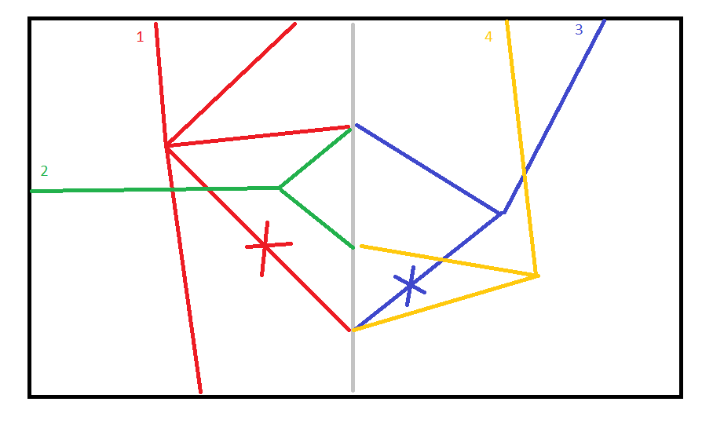

The solution works for up to the 5-th level.
On the 6-th one RAM consumption goes into space :(

To run save the map into the __/map.txt__ file in the current directory
(cr/lf line ends, without the "map:" first line), then execute Application.main.
The program will output some log info and then save the list of rotations
into the __rotations.txt__ file in the current directory.

There is a small app in the index.html file (just open in a browser).
You can type command + enter in the "Command:" field.
You can also enter multiple commands in the text area below the map.
Everything is logged in the console. The map in the page document is also clickable
(may be slow for L >= 4). I usually create a map with the browser app and then copy it into
the map.txt file (was too lazy to create a normal UI in the Java app itself :)).

The algorithm idea is quite simple (although not effective enough to solve level 6 :( ):

1. The whole map is __splitted into two halves__ along the longest side.
2. For each half the algorithm calculates all possible valid states of the map for that particular half. Each state
is minimized down until a tree of depth 1, with the leaves being pipe fragments located on the __edges of the half of the field__
3. Next, the algorithm searches minimized trees from both halves which fully connect to each other on the separation edge
4. All combined trees are minimized, now for the whole region.
5. The process is recursive, up to the half size of 1x1

Below is a rough illustration of a region splitted in halves, with some identified minimized pipe trees.
Note that the trees 1 and 3 are fully connected along the separation edge (the gray one):

__Update__: almost forgot - only the tree pairs are picked if they have __just and only one__ connection on
the separation edge, otherwise it either introduces a cycle of an incomplete branch (which does end with a terminal
pipe fragment)
  